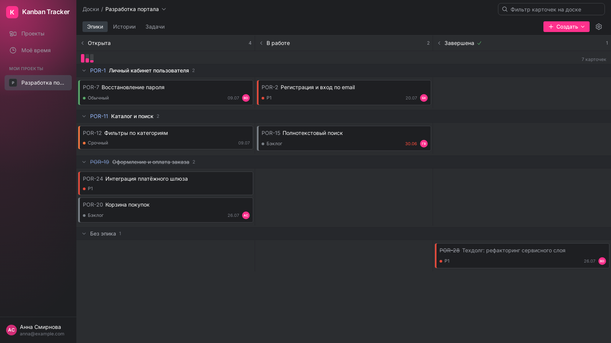
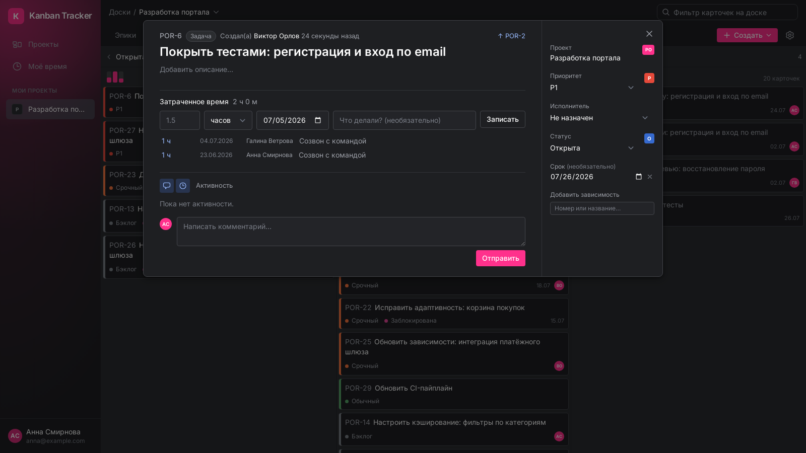
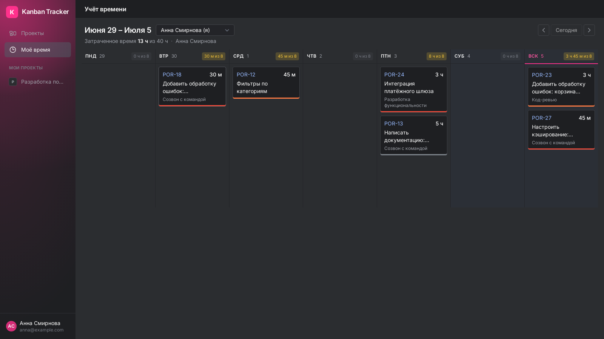
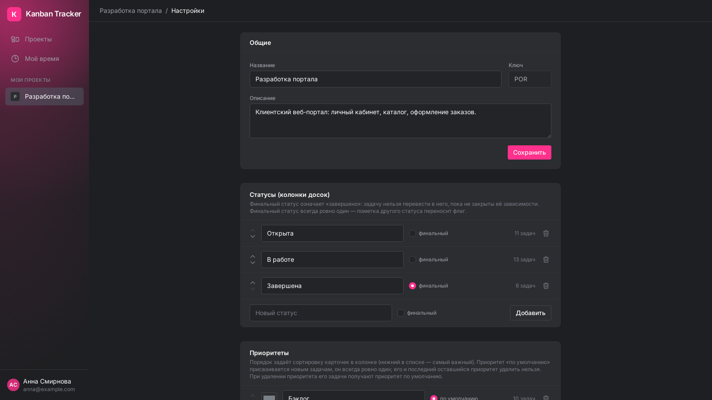

# Kanban Tracker

Веб-приложение для управления проектами: пользователи, проекты, задачи трёх уровней
(эпик → история пользователя → задача), настраиваемые статусы и приоритеты, канбан-доски
с drag&drop и live-обновлениями, зависимости между задачами, лог смены статусов,
комментарии и учёт потраченного времени.

Интерфейс (тёмная тема) вдохновлён современными коммерческими таск-трекерами, в том числе
YouTrack от JetBrains. Проект некоммерческий и учебный, никак не аффилирован с JetBrains
и не использует её код, ресурсы или товарные знаки.

## Скриншоты

**Канбан-доска** — свимлейны по эпикам, цветные полоски приоритетов, гистограмма
распределения по статусам, сворачиваемые строки и колонки, живой фильтр:



**Карточка задачи** — описание, зависимости, учёт времени, лента активности
(комментарии + история статусов), панель полей:



**Учёт времени** — неделя по дням с нормой «X ч из 8», переключение недель и сотрудников:



**Настройки проекта** — статусы (колонки досок), приоритеты с цветами, участники:



## Стек

- Laravel 12 (PHP 8.4), Livewire 3 + Alpine.js, Tailwind CSS
- PostgreSQL 16, Redis 7 (кэш, сессии, очереди)
- Centrifugo v5 — live-обновление досок по WebSocket
- SortableJS — drag&drop карточек
- Laravel Breeze (Livewire) — регистрация и вход строго по email
- Всё в Docker: `app` (php-fpm), `queue`, `nginx`, `postgres`, `redis`, `centrifugo`, `node` (сборка assets), `mailpit`

## Запуск

```bash
docker compose up -d --build
docker compose exec app php artisan migrate:fresh --seed
```

Приложение: http://localhost:8080
Почта (mailpit, письма сброса пароля): http://localhost:8025
PostgreSQL с хоста: `localhost:55432`, база/пользователь/пароль — `kanban`/`kanban`/`secret`

Контейнер `node` одноразовый: при каждом `docker compose up` собирает фронтенд
(`npm install && npm run build`) и завершается. Для пересборки assets после правок фронта:
`docker compose up node`.

### Производительность на Windows (bind mount)

Файловый I/O через Docker Desktop медленный, поэтому dev-окружение настроено так:
- `opcache.validate_timestamps=0` — PHP-код кэшируется до перезапуска. **После правок PHP: `docker compose restart app queue`** (blade-вьюхи подхватываются без перезапуска).
- Скомпилированные вьюхи в `/tmp` контейнера (`VIEW_COMPILED_PATH`), логи в stderr (`docker compose logs app`), конфиг и роуты закэшированы. **После правок `.env` или `routes/`: `docker compose exec app php artisan config:cache route:cache`.**

На Linux-сервере всё это не обязательно, но и не мешает.

## Продакшен

Для деплоя есть `docker-compose.prod.yml`: тот же стек, но веб-сервер стека слушает только
`127.0.0.1:8090` — снаружи его проксирует системный nginx хоста (vhost + certbot),
Centrifugo конфигурируется переменными окружения, секреты — в серверном `.env`.

## Демо-пользователи

Пароль у всех: **password**

| Email | Имя |
| --- | --- |
| anna@example.com | Анна Смирнова |
| boris@example.com | Борис Кузнецов |
| viktor@example.com | Виктор Орлов |
| galina@example.com | Галина Ветрова |

Сидер создаёт два проекта: «Разработка портала» (POR, стандартные статусы) и
«Мобильное приложение» (MOB, кастомный набор из 5 статусов), с эпиками, историями,
задачами, «сиротами» без родителя, зависимостями, комментариями и записями времени
за две недели.

## Основные механики

- **Нумерация**: сквозной счётчик на проект, номер вида `POR-17` — тип задачи на номер не влияет.
- **Иерархия**: story может принадлежать только epic, task — только story; допускаются задачи без родителя (строки «Без эпика» / «Без истории» в конце доски).
- **Три доски** на проект: «Эпики» (строки-эпики × статусы, карточки-истории), «Истории» (строки-истории, карточки-задачи), «Задачи» (плоская).
- **Drag&drop**: оптимистичный — карточка сразу остаётся на месте, при ошибке сервер возвращает её и показывает тост; строка задаёт родителя (эпик/историю), колонка — статус, оба применяются одним движением.
- **Зависимости**: задачу нельзя перевести в финальный статус, пока не закрыты все задачи, от которых она зависит; циклы запрещены.
- **Live-обновления**: перенос карточки публикуется в Centrifugo (канал `project.{id}.board`), у остальных зрителей доска обновляется без перезагрузки.
- **Статусы**: настраиваются в проекте (имя, порядок, финальность); финальный статус всегда ровно один — пометка другого статуса переносит флаг.
- **Приоритеты**: настраиваются в проекте (имя, цвет, порядок); при создании проекта — Бэклог (по умолчанию), Обычный, Срочный, P1. Приоритет «по умолчанию» ровно один, его и последний оставшийся удалить нельзя; при удалении приоритета задачи переводятся на дефолтный.
- **Доска**: колонки тянутся по ширине (минимум 245px, при избытке статусов — горизонтальный скролл только доски), строки и колонки сворачиваются без запросов на сервер (свёрнутая колонка показывает карточки цветными квадратиками), фильтр карточек по номеру/названию, мини-гистограмма распределения по статусам.
- **Учёт времени**: страница «Моё время» — неделя колонками-днями с нормой «X ч из 8», суммы за день и неделю, переключение недель и просмотр времени коллег по общим проектам.
- **Акцентный цвет**: настраивается в профиле (по умолчанию фуксия #FF318C) — кнопки, аватарки, свечение сайдбара, индикатор загрузки.
